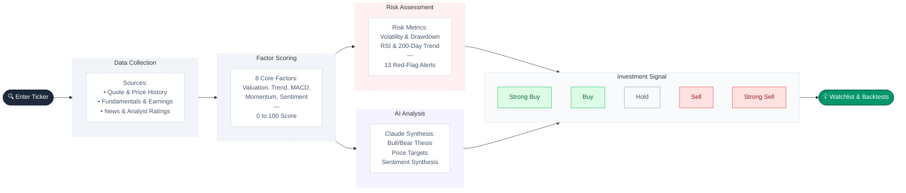

# jaja-money — Stock Analysis Dashboard

[](https://github.com/pcjtse/jaja-money/actions/workflows/ci.yml)

> ⚠️ **Investment Disclaimer** — jaja-money is a research and educational tool only.
> **Nothing in this application constitutes financial, investment, or trading advice.**
> Always consult a qualified financial advisor before making any investment decisions.
> Past performance shown in backtests does not guarantee future results.

A Streamlit-based stock analysis dashboard powered by the **Finnhub API** and **Claude AI**.
Enter any ticker to get real-time quotes, interactive charts, technical indicators,
AI-driven fundamental analysis, FinBERT news sentiment, an 8-factor quantitative score,
and a comprehensive risk guardrail engine — all in a clean dark-theme UI.

---

## Screenshots

| Homepage | Stock Analysis |
|----------|----------------|
|  |  |

| Compare Stocks | Stock Screener |
|----------------|----------------|
|  |  |

| Portfolio Analysis | Sector Rotation |
|--------------------|-----------------|
|  |  |

| Strategy Backtesting | |
|----------------------|-|
|  | |

---

## Analysis Workflow



---

## Key Features

### Market Data & Technicals
- **Real-time quotes** — price, change, day high/low, previous close
- **Company overview** — sector, market cap, P/E, EPS, dividend yield, 52-week range
- **Interactive price chart** — candlestick with SMA(50/200), Bollinger Bands, volume, OBV, VWAP
- **Technical indicators** — RSI(14), MACD, Fibonacci levels (computed locally)
- **Earnings history** — EPS vs estimate vs surprise for last 4 quarters
- **Analyst recommendations** — consensus bar chart and estimate revision momentum
- **Insider trading** — recent insider buy/sell activity
- **Options market data** — IV surface and hedge suggestions
- **Export** — CSV, HTML report, or PDF download

### Factor Score Engine
Eight factors scored 0–100 and weighted into a single composite signal (Strong Sell → Strong Buy),
displayed as a gauge, radar chart, and progress-bar breakdown:

| Factor | Weight |
|--------|--------|
| Valuation (P/E) | 15% |
| Trend (SMA-50/200) | 20% |
| Momentum (RSI-14) | 10% |
| MACD Signal | 10% |
| News Sentiment | 15% |
| Earnings Quality | 15% |
| Analyst Consensus | 10% |
| 52-Week Strength | 5% |

### Risk Guardrails
Four risk dimensions weighted into an overall **Risk Score** (Low → Extreme),
with 13 colour-coded red-flag alerts covering volatility, drawdown, overbought/oversold
RSI, downtrend conditions, high P/E, earnings miss rate, and negative analyst sentiment.

### AI Analysis (Claude Opus 4.6)
- **Fundamental analysis** — 8-section investment research report streamed live
- **News sentiment themes** — Claude synthesises bullish/bearish narratives from headlines
- **Price target** — AI-generated 12-month price target with bull/bear scenarios
- **Interactive chat** — Ask any question about the stock; Claude answers with full context
- **SEC EDGAR** — Fetch and analyse 10-K, 10-Q, and 8-K filings directly from EDGAR
- **Autonomous agent** — Multi-step research workflow with tool-call authority (up to 10 turns)

### Multi-Page App
| Page | Description |
|------|-------------|
| **Compare** | Side-by-side factor scores, risk, P/E, RSI for up to 5 stocks with correlation heatmap |
| **Screener** | Filter S&P 500 or custom universe by factor/risk/P/E/RSI; supports Claude natural-language queries |
| **Portfolio** | Correlation matrix, beta, Monte Carlo simulation, Kelly sizing, factor attribution |
| **Sectors** | Relative strength across 11 S&P 500 sector ETFs with rotation phase classification |
| **Backtest** | Historical signal simulation with equity curve, Sharpe ratio, max drawdown, and DRIP support |
| **Forward Test** | Paper portfolio tracker to validate AI signals without real capital |

### Additional Capabilities
- **Watchlist** — Save tickers with factor scores; persisted across sessions
- **Price & signal alerts** — Threshold alerts with Slack / Discord / Telegram webhook delivery
- **Daily digest** — Claude-written morning briefing for your entire watchlist (HTML + optional email)
- **Named snapshots** — Save and diff analysis states over time
- **Google Sheets export** — Write results to a Google Sheet via service account
- **Brokerage CSV import** — Auto-detect Schwab, Fidelity, and IBKR position exports
- **REST API** — FastAPI server for programmatic access (see [REST_API.md](REST_API.md))
- **Agent Skill** — Use as an [Agent Skill](https://agentskills.io) with OpenClaw, Claude Code, or any compatible AI agent (see below)

---

## Agent Skill — jaja-money

jaja-money is packaged as an **Agent Skill** following the [Agent Skills standard](https://agentskills.io).
The skill lives in the `jaja_money_skill/` directory and can be used with any AI agent
that supports the standard, including **OpenClaw** and **Claude Code**.

> **Note:** Real order execution has been removed. `broker.py` provides read-only Alpaca
> account/position monitoring and a **simulation-only** `execute_signal()` that returns
> what a trade *would* do without placing any real orders.

### Skill Structure

```
jaja_money_skill/
├── SKILL.md              # Skill metadata + instructions (Agent Skills standard)
├── __init__.py
├── scripts/
│   ├── __init__.py
│   ├── jaja_skill.py     # Core skill functions (analyze, score, screen, etc.)
│   ├── jaja_client.py    # HTTP client for remote mode
│   └── jaja_events.py    # Event-triggered analysis scheduler
├── references/
│   ├── api_schema.md     # Full API response schemas
│   └── endpoints.md      # REST API endpoint documentation
└── assets/               # Static resources (templates, data files)
```

### Installation

#### With OpenClaw

Copy or symlink the `jaja_money_skill/` directory into your OpenClaw skills directory:

```bash
# Clone the repo
git clone https://github.com/pcjtse/jaja-money.git
cd jaja-money

# Copy the skill to your OpenClaw skills directory
cp -r jaja_money_skill/ ~/.openclaw/skills/jaja-money/

# Or symlink for development
ln -s "$(pwd)/jaja-money-skill" ~/.openclaw/skills/jaja-money
```

Then configure the required environment variables:

```bash
export FINNHUB_API_KEY=your_finnhub_key
export ANTHROPIC_API_KEY=your_anthropic_key   # optional, for AI research
```

OpenClaw will auto-discover the skill from `SKILL.md` and make its functions available.

#### With Claude Code

Add the skill to your Claude Code project by referencing the skill directory:

```bash
# From the jaja-money project root
claude --skill ./jaja-money-skill
```

Or add to your project's `.claude/settings.json`:

```json
{
  "skills": ["./jaja-money-skill"]
}
```

Claude Code will load the `SKILL.md` and make the skill functions available in your sessions.

#### Standalone Python Usage

```bash
pip install -r requirements.txt
```

### Skill Capabilities

| Capability | Function | Description |
|------------|----------|-------------|
| Full analysis | `analyze(ticker)` | Factor scores, risk, financials, signal |
| Quick score | `score(ticker)` | Lightweight factor/risk scores |
| Screening | `screen(tickers, ...)` | Filter tickers by factor/risk thresholds |
| Alerts | `get_alerts(symbol)` | Active price and signal alerts |
| Research | `research(ticker, question)` | Autonomous multi-step investment research |

### 1. Using the Skill (Python)

The skill can run **locally** (importing analysis modules directly) or in
**remote mode** — connecting to any running jaja-money server over HTTP.

**Local mode:**

```python
from jaja_money_skill.scripts.jaja_skill import analyze, screen, score, get_alerts, research

# Full fundamental + risk analysis
result = analyze("AAPL")
# {'symbol': 'AAPL', 'signal': 'BUY', 'confidence': 74, 'factor_score': 72, ...}

# Lightweight factor/risk score only
s = score("MSFT")
# {'symbol': 'MSFT', 'signal': 'HOLD', 'confidence': 50, ...}

# Screen a list of tickers
hits = screen(["AAPL", "MSFT", "NVDA"], min_factor_score=65, max_risk_score=50)

# Active price/signal alerts
alerts = get_alerts("AAPL")

# Autonomous multi-step research agent (returns full memo dict)
memo = research("TSLA", question="What is the bear case?")
```

**Remote mode** — point the skill at a running jaja-money server:

```bash
export JAJA_API_URL=http://analysis-server:8080
export JAJA_API_KEY=mysecret   # optional, forwarded as X-API-Key
```

```python
from jaja_money_skill.scripts.jaja_skill import analyze, score

result = analyze("AAPL")   # calls http://analysis-server:8080/analyze
s = score("MSFT")          # calls http://analysis-server:8080/score
```

You can also use `JajaMoneyClient` directly for finer control:

```python
from jaja_money_skill.scripts.jaja_client import JajaMoneyClient

client = JajaMoneyClient("http://analysis-server:8080", api_key="mysecret")
client.health()                         # GET /health
client.analyze("AAPL")                  # POST /analyze
client.score("MSFT")                    # POST /score
client.screen(["AAPL", "MSFT"])         # POST /screen
client.signals(["AAPL", "MSFT"])        # POST /signals
client.get_alerts("AAPL")              # GET /alerts?symbol=AAPL
client.research("TSLA", question="Bear case?")  # POST /openclaw/agent
```

### 2. REST API Endpoints

Start the API server:

```bash
uvicorn server:app --host 0.0.0.0 --port 8080
# or: python server.py
```

**`POST /score`** — lightweight factor + risk scores:

```bash
curl -X POST http://localhost:8080/score \
  -H "Content-Type: application/json" \
  -d '{"symbol": "AAPL"}'
```

```json
{
  "symbol": "AAPL",
  "factor_score": 72,
  "composite_label": "Buy",
  "risk_score": 38,
  "risk_level": "Low",
  "signal": "BUY",
  "confidence": 74,
  "factors": [],
  "flags": [],
  "timestamp": 1742500000
}
```

**`GET /alerts`** — list active price/signal alerts:

```bash
curl "http://localhost:8080/alerts"
curl "http://localhost:8080/alerts?symbol=AAPL"
```

**`POST /signals`** — batch BUY / HOLD / SELL signals with confidence scores:

```bash
curl -X POST http://localhost:8080/signals \
  -H "Content-Type: application/json" \
  -d '{"symbols": ["AAPL", "MSFT", "NVDA"]}'
```

Signal logic:

| Signal | Condition |
|--------|-----------|
| **BUY** | `factor_score >= 65` **and** `risk_score <= 50` |
| **SELL** | `factor_score <= 35` **or** `risk_score >= 75` |
| **HOLD** | everything else |

**`POST /openclaw/agent`** — streams the autonomous research agent:

```bash
curl -X POST http://localhost:8080/openclaw/agent \
  -H "Content-Type: application/json" \
  -d '{"symbol": "AAPL", "question": "What is the bull case?"}'
```

**`POST /openclaw/rebalance`** — portfolio drift analysis and rebalancing suggestions:

```bash
curl -X POST http://localhost:8080/openclaw/rebalance \
  -H "Content-Type: application/json" \
  -d '{
    "tickers": ["AAPL", "MSFT"],
    "target_weights": {"AAPL": 0.6, "MSFT": 0.4},
    "current_weights": {"AAPL": 0.72, "MSFT": 0.28}
  }'
```

**`GET /openclaw/manifest`** — returns the skill manifest.

### 3. Alpaca Account Monitoring (Read-Only)

`broker.py` provides **read-only** monitoring of an [Alpaca](https://alpaca.markets)
account. `execute_signal()` always returns a simulation result.

```bash
ALPACA_API_KEY=your_alpaca_key
ALPACA_API_SECRET=your_alpaca_secret
ALPACA_BASE_URL=https://paper-api.alpaca.markets   # default
```

```python
from jaja_money_skill.scripts.jaja_skill import score
from broker import execute_signal

s = score("AAPL")
result = execute_signal(
    "AAPL",
    signal=s["signal"],
    qty=10,
    factor_score=s["factor_score"],
    risk_score=s["risk_score"],
)
# Always returns a simulation — use Forward Test for paper portfolio tracking
```

### 4. Incoming Webhook Receiver

**`POST /openclaw/webhook`** accepts commands from an AI agent at runtime.

| `event_type` | Required `payload` fields | Action |
|---|---|---|
| `analyze_request` | `symbol` | Runs full analysis and returns signal |
| `alert_request` | `symbol`, `condition`, `threshold` | Creates a price alert |
| `screen_request` | `tickers` | Runs the screener and returns results |

```bash
curl -X POST http://localhost:8080/openclaw/webhook \
  -H "Content-Type: application/json" \
  -d '{
    "event_type": "analyze_request",
    "payload": {"symbol": "NVDA"},
    "agent_id": "my-agent"
  }'
```

### 5. Event-Triggered Analysis

The event scheduler uses APScheduler to automatically fire analysis callbacks
when market events occur.

| Event type | Trigger condition |
|---|---|
| `earnings_approaching` | Earnings date within 3 days |
| `new_sec_filing` | 10-K, 10-Q, or 8-K filed today |
| `price_alert_triggered` | Price / factor threshold breached |

```python
from jaja_money_skill.scripts.jaja_events import (
    register_event_callback,
    start_event_scheduler,
    stop_event_scheduler,
)

def on_earnings(event):
    from jaja_money_skill.scripts.jaja_skill import score
    s = score(event["symbol"])
    print(f"{event['symbol']} earnings in {event['days_away']}d — signal: {s['signal']}")

register_event_callback("earnings_approaching", on_earnings)
start_event_scheduler(tickers=["AAPL", "MSFT", "NVDA"], interval_seconds=300)
```

Configure in `config.yaml`:

```yaml
openclaw:
  event_scheduler_interval_seconds: 300
  earnings_alert_days_ahead: 3
  signal_buy_factor_min: 65
  signal_buy_risk_max: 50
  signal_sell_factor_max: 35
  signal_sell_risk_min: 75
```

### Full Environment Variables

| Variable | Required | Description |
|---|---|---|
| `FINNHUB_API_KEY` | Yes | Finnhub market data |
| `ANTHROPIC_API_KEY` | Yes* | Claude AI (*or use `ai_backend: cli`) |
| `JAJA_API_KEY` | No | Protects REST API endpoints (disabled if unset) |
| `JAJA_API_URL` | Remote mode | URL of jaja-money server for remote skill mode (e.g. `http://host:8080`) |
| `JAJA_API_PORT` | No | REST API server port (default: `8080`) |
| `ALPACA_API_KEY` | Monitoring only | Alpaca API key for read-only account monitoring |
| `ALPACA_API_SECRET` | Monitoring only | Alpaca API secret |
| `ALPACA_BASE_URL` | Monitoring only | Alpaca base URL (default: `https://paper-api.alpaca.markets`) |

---

## Prerequisites

- **Python 3.10+**
- A free [Finnhub](https://finnhub.io) API key
- An [Anthropic](https://console.anthropic.com) API key **or** the [Claude Code CLI](https://claude.ai/code)

> **Tip:** If you have Claude Code CLI installed (`claude` on your PATH), you can set
> `ai_backend: "cli"` in `config.yaml` and skip the `ANTHROPIC_API_KEY` entirely.

---

## Setup

1. **Clone and enter the repo:**
   ```bash
   cd jaja-money
   ```

2. **Create a virtual environment:**
   ```bash
   python3 -m venv venv
   source venv/bin/activate        # macOS / Linux
   # venv\Scripts\activate          # Windows
   ```

3. **Install dependencies:**
   ```bash
   pip install -r requirements.txt
   ```
   > The FinBERT model (~500 MB) downloads automatically on first run and is cached locally.

4. **Configure API keys:**
   ```bash
   cp .env.example .env
   ```
   Edit `.env`:
   ```
   FINNHUB_API_KEY=your_finnhub_key_here
   ANTHROPIC_API_KEY=your_anthropic_key_here
   ```

---

## Usage

```bash
streamlit run app.py
```

Open `http://localhost:8501`, enter a ticker (e.g. `AAPL`) in the sidebar, and click **Analyze**.
Use the sidebar navigation to switch between pages.

### Docker

```bash
# Quick start
cp .env.example .env   # add your keys
docker compose up --build

# With Redis cache
docker compose --profile redis up --build
```

Persistent data (history, watchlist, alerts, cache) is stored inside the container at
`~/.jaja-money/`. Mount a volume to keep it across restarts:
```bash
docker run -p 8501:8501 --env-file .env \
  -v "$HOME/.jaja-money:/root/.jaja-money" jaja-money
```

---

## ⚠️ API Usage Limits

**Set spending and rate limits before running bulk operations.**
The Screener and Sector pages can make hundreds of API calls in a single session.

### Anthropic (Claude) — Spend Limits

1. Go to [console.anthropic.com](https://console.anthropic.com) → **Settings → Billing**
2. Set a **monthly spend limit** (e.g. $10–20 for light use, $50+ for heavy screener workflows)
3. Optionally set a notification threshold to get an email before you reach your cap

Every "Analyze with Claude" call streams ~1 000–3 000 tokens. Claude responses are
disk-cached for 30 minutes, so re-running the same analysis is free — but new symbols always
hit the API.

### Finnhub — Rate Limits

The free plan allows **60 requests per minute**.
Approximate call counts per operation:

| Operation | API calls |
|-----------|-----------|
| Single stock analysis | ~12 |
| Compare (5 stocks) | ~25 |
| Sector Rotation (11 ETFs) | ~55 |
| Screener — S&P 500 (100 tickers) | ~400–500 |
| Screener — Russell 1000 (500 tickers) | ~2 000–2 500 |

Monitor usage at [finnhub.io/dashboard](https://finnhub.io/dashboard).
For the Screener, prefer the **Default** or **S&P 500** universe to stay within free-tier limits.
If you see `429 Too Many Requests`, wait 60 seconds before retrying.

---

## Webhook Notifications

Configure Slack, Discord, or Telegram alerts in `config.yaml`:

```yaml
webhooks:
  slack_url: "https://hooks.slack.com/services/..."
  discord_url: "https://discord.com/api/webhooks/..."
  telegram_token: "123456:ABC-..."
  telegram_chat_id: "-100123456789"
```

---

*For REST API documentation, see [REST_API.md](REST_API.md).*
