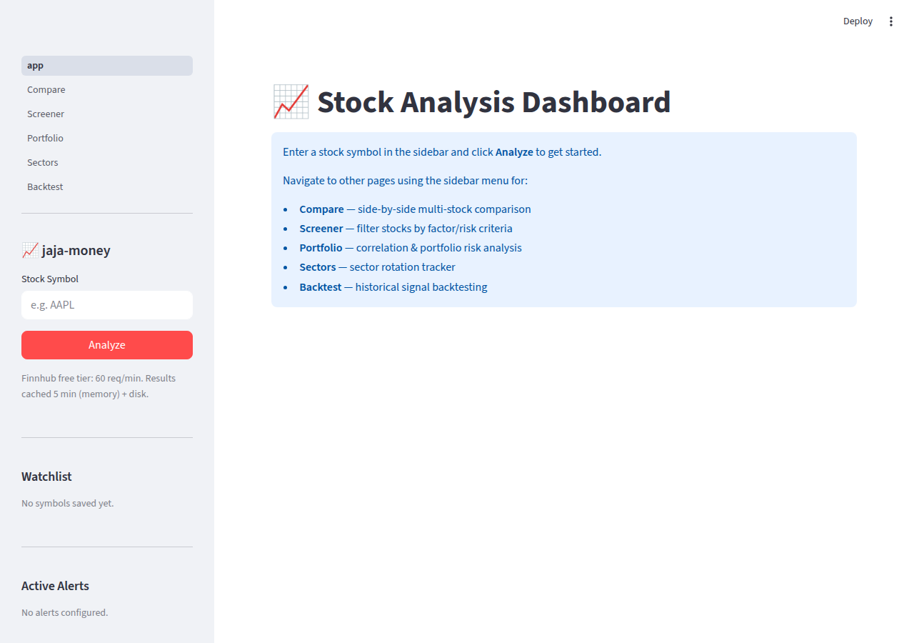
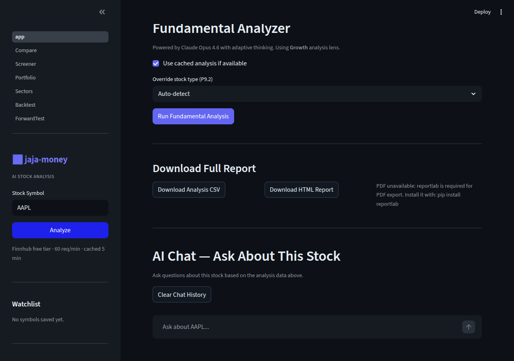
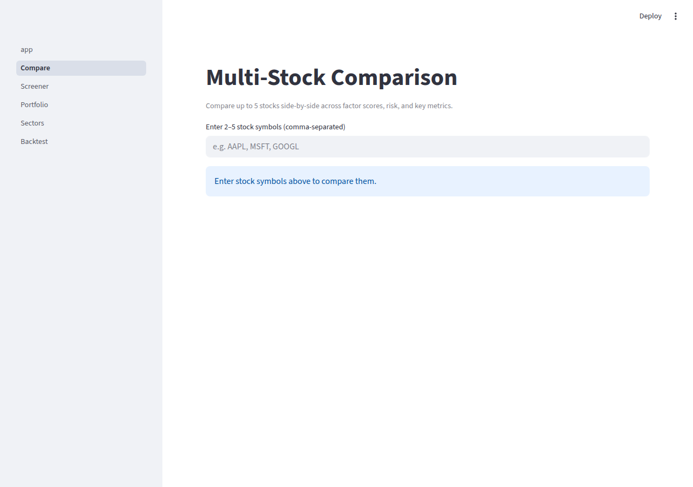
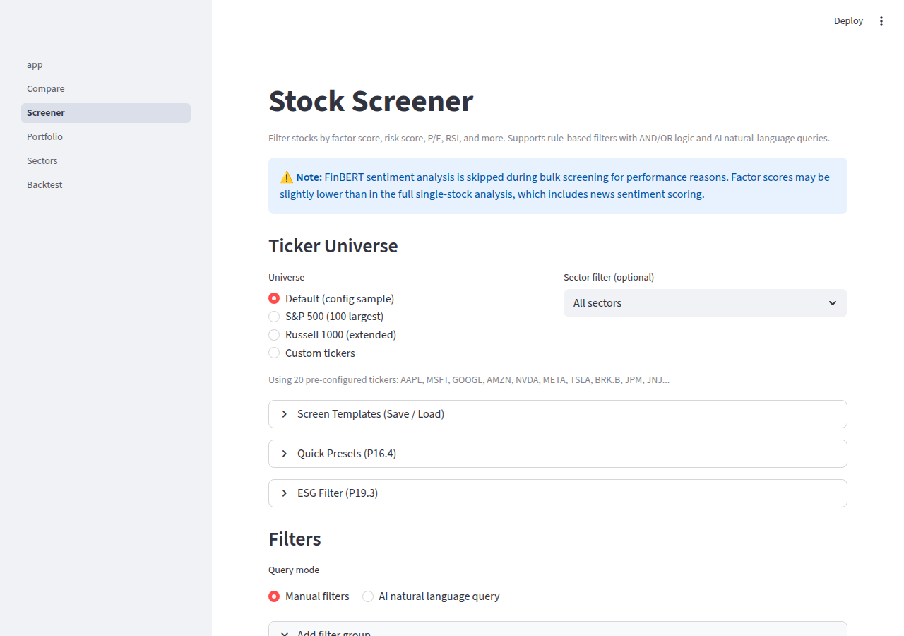
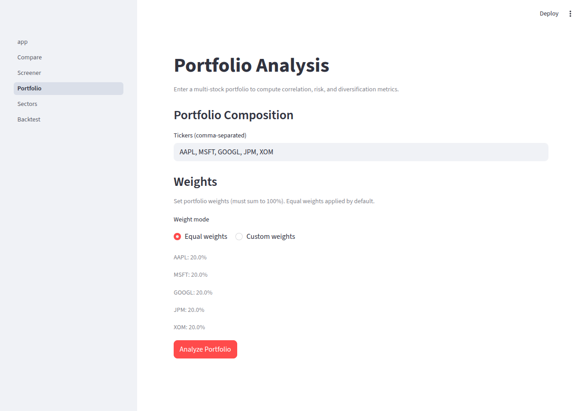
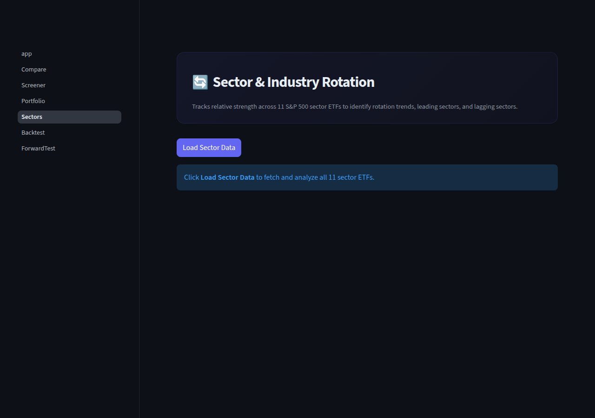
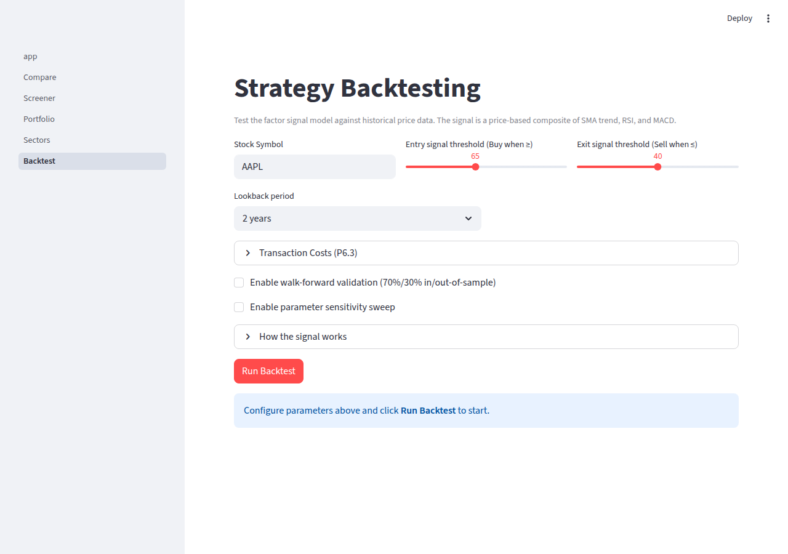
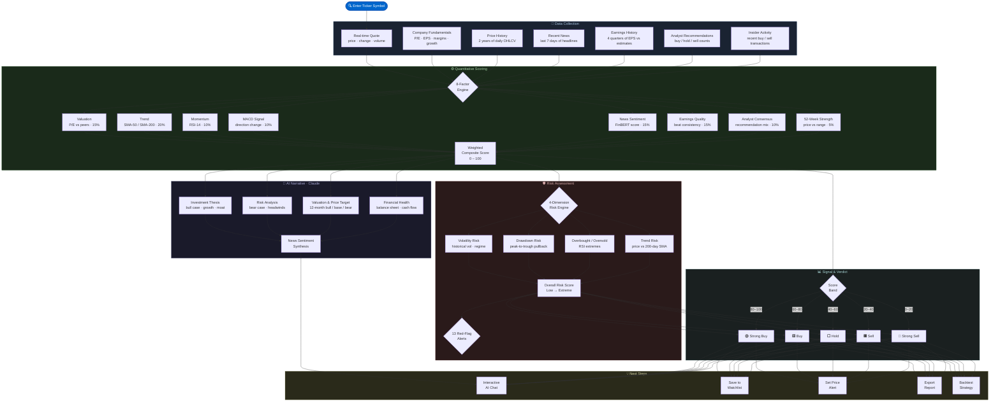

# jaja-money — Stock Analysis Dashboard

[](https://github.com/pcjtse/jaja-money/actions/workflows/ci.yml)

> ⚠️ **Investment Disclaimer** — jaja-money is a research and educational tool only.
> **Nothing in this application constitutes financial, investment, or trading advice.**
> Always consult a qualified financial advisor before making any investment decisions.
> Past performance shown in backtests does not guarantee future results.

A Streamlit-based stock analysis dashboard powered by the **Finnhub API** and **Claude AI**.
Enter any ticker to get real-time quotes, interactive charts, technical indicators,
AI-driven fundamental analysis, FinBERT news sentiment, an 8-factor quantitative score,
and a comprehensive risk guardrail engine — all in a clean dark-theme UI.

---

## Screenshots

| Homepage | Stock Analysis |
|----------|----------------|
|  |  |

| Compare Stocks | Stock Screener |
|----------------|----------------|
|  |  |

| Portfolio Analysis | Sector Rotation |
|--------------------|-----------------|
|  |  |

| Strategy Backtesting | |
|----------------------|-|
|  | |

---

## Analysis Workflow



---

## Key Features

### Market Data & Technicals
- **Real-time quotes** — price, change, day high/low, previous close
- **Company overview** — sector, market cap, P/E, EPS, dividend yield, 52-week range
- **Interactive price chart** — candlestick with SMA(50/200), Bollinger Bands, volume, OBV, VWAP
- **Technical indicators** — RSI(14), MACD, Fibonacci levels (computed locally)
- **Earnings history** — EPS vs estimate vs surprise for last 4 quarters
- **Analyst recommendations** — consensus bar chart and estimate revision momentum
- **Insider trading** — recent insider buy/sell activity
- **Options market data** — IV surface and hedge suggestions
- **Export** — CSV, HTML report, or PDF download

### Factor Score Engine
Eight factors scored 0–100 and weighted into a single composite signal (Strong Sell → Strong Buy),
displayed as a gauge, radar chart, and progress-bar breakdown:

| Factor | Weight |
|--------|--------|
| Valuation (P/E) | 15% |
| Trend (SMA-50/200) | 20% |
| Momentum (RSI-14) | 10% |
| MACD Signal | 10% |
| News Sentiment | 15% |
| Earnings Quality | 15% |
| Analyst Consensus | 10% |
| 52-Week Strength | 5% |

### Risk Guardrails
Four risk dimensions weighted into an overall **Risk Score** (Low → Extreme),
with 13 colour-coded red-flag alerts covering volatility, drawdown, overbought/oversold
RSI, downtrend conditions, high P/E, earnings miss rate, and negative analyst sentiment.

### AI Analysis (Claude Opus 4.6)
- **Fundamental analysis** — 8-section investment research report streamed live
- **News sentiment themes** — Claude synthesises bullish/bearish narratives from headlines
- **Price target** — AI-generated 12-month price target with bull/bear scenarios
- **Interactive chat** — Ask any question about the stock; Claude answers with full context
- **SEC EDGAR** — Fetch and analyse 10-K, 10-Q, and 8-K filings directly from EDGAR
- **Autonomous agent** — Multi-step research workflow with tool-call authority (up to 10 turns)

### Multi-Page App
| Page | Description |
|------|-------------|
| **Compare** | Side-by-side factor scores, risk, P/E, RSI for up to 5 stocks with correlation heatmap |
| **Screener** | Filter S&P 500 or custom universe by factor/risk/P/E/RSI; supports Claude natural-language queries |
| **Portfolio** | Correlation matrix, beta, Monte Carlo simulation, Kelly sizing, factor attribution |
| **Sectors** | Relative strength across 11 S&P 500 sector ETFs with rotation phase classification |
| **Backtest** | Historical signal simulation with equity curve, Sharpe ratio, max drawdown, and DRIP support |
| **Forward Test** | Paper portfolio tracker to validate AI signals without real capital |

### Additional Capabilities
- **Watchlist** — Save tickers with factor scores; persisted across sessions
- **Price & signal alerts** — Threshold alerts with Slack / Discord / Telegram webhook delivery
- **Daily digest** — Claude-written morning briefing for your entire watchlist (HTML + optional email)
- **Named snapshots** — Save and diff analysis states over time
- **Google Sheets export** — Write results to a Google Sheet via service account
- **Brokerage CSV import** — Auto-detect Schwab, Fidelity, and IBKR position exports
- **REST API** — FastAPI server for programmatic access (see [REST_API.md](REST_API.md))

---

## Prerequisites

- **Python 3.10+**
- A free [Finnhub](https://finnhub.io) API key
- An [Anthropic](https://console.anthropic.com) API key **or** the [Claude Code CLI](https://claude.ai/code)

> **Tip:** If you have Claude Code CLI installed (`claude` on your PATH), you can set
> `ai_backend: "cli"` in `config.yaml` and skip the `ANTHROPIC_API_KEY` entirely.

---

## Setup

1. **Clone and enter the repo:**
   ```bash
   cd jaja-money
   ```

2. **Create a virtual environment:**
   ```bash
   python3 -m venv venv
   source venv/bin/activate        # macOS / Linux
   # venv\Scripts\activate          # Windows
   ```

3. **Install dependencies:**
   ```bash
   pip install -r requirements.txt
   ```
   > The FinBERT model (~500 MB) downloads automatically on first run and is cached locally.

4. **Configure API keys:**
   ```bash
   cp .env.example .env
   ```
   Edit `.env`:
   ```
   FINNHUB_API_KEY=your_finnhub_key_here
   ANTHROPIC_API_KEY=your_anthropic_key_here
   ```

---

## Usage

```bash
streamlit run app.py
```

Open `http://localhost:8501`, enter a ticker (e.g. `AAPL`) in the sidebar, and click **Analyze**.
Use the sidebar navigation to switch between pages.

### Docker

```bash
# Quick start
cp .env.example .env   # add your keys
docker compose up --build

# With Redis cache
docker compose --profile redis up --build
```

Persistent data (history, watchlist, alerts, cache) is stored inside the container at
`~/.jaja-money/`. Mount a volume to keep it across restarts:
```bash
docker run -p 8501:8501 --env-file .env \
  -v "$HOME/.jaja-money:/root/.jaja-money" jaja-money
```

---

## ⚠️ API Usage Limits

**Set spending and rate limits before running bulk operations.**
The Screener and Sector pages can make hundreds of API calls in a single session.

### Anthropic (Claude) — Spend Limits

1. Go to [console.anthropic.com](https://console.anthropic.com) → **Settings → Billing**
2. Set a **monthly spend limit** (e.g. $10–20 for light use, $50+ for heavy screener workflows)
3. Optionally set a notification threshold to get an email before you reach your cap

Every "Analyze with Claude" call streams ~1 000–3 000 tokens. Claude responses are
disk-cached for 30 minutes, so re-running the same analysis is free — but new symbols always
hit the API.

### Finnhub — Rate Limits

The free plan allows **60 requests per minute**.
Approximate call counts per operation:

| Operation | API calls |
|-----------|-----------|
| Single stock analysis | ~12 |
| Compare (5 stocks) | ~25 |
| Sector Rotation (11 ETFs) | ~55 |
| Screener — S&P 500 (100 tickers) | ~400–500 |
| Screener — Russell 1000 (500 tickers) | ~2 000–2 500 |

Monitor usage at [finnhub.io/dashboard](https://finnhub.io/dashboard).
For the Screener, prefer the **Default** or **S&P 500** universe to stay within free-tier limits.
If you see `429 Too Many Requests`, wait 60 seconds before retrying.

---

## Webhook Notifications

Configure Slack, Discord, or Telegram alerts in `config.yaml`:

```yaml
webhooks:
  slack_url: "https://hooks.slack.com/services/..."
  discord_url: "https://discord.com/api/webhooks/..."
  telegram_token: "123456:ABC-..."
  telegram_chat_id: "-100123456789"
```

---

*For REST API documentation, see [REST_API.md](REST_API.md).*
