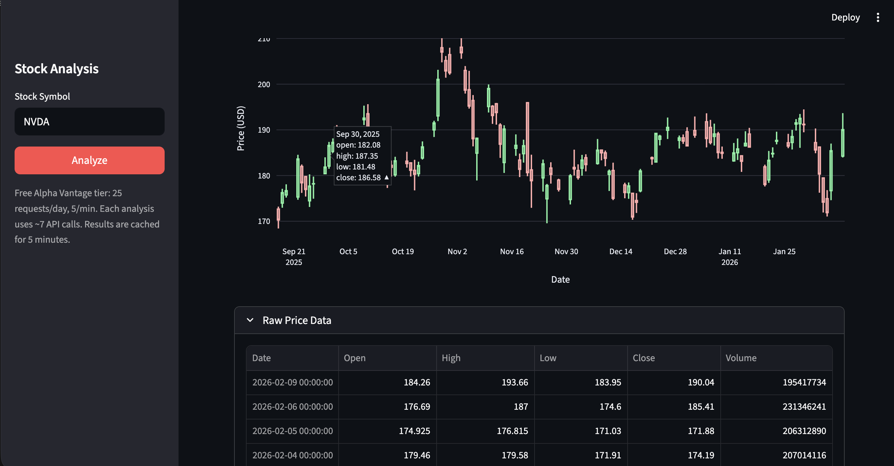

# Stock Analysis Dashboard

A Streamlit-based stock analysis app powered by the Finnhub API and Claude AI.
Enter a stock symbol to get real-time quotes, technicals, AI-driven fundamental
analysis, FinBERT news sentiment, an 8-factor quantitative score, a risk
guardrail engine with actionable alerts, multi-stock comparison, a stock
screener, portfolio analysis, sector rotation tracking, and strategy
backtesting.



## Features

### Market Data
- **Stock Quote** — Current price, change, day high/low, previous close
- **Company Overview** — Name, sector, market cap, P/E, EPS, dividend yield, 52-week range
- **Technical Indicators** — SMA(50), SMA(200), RSI(14), MACD with signal and histogram (computed locally from price data)
- **Price Chart** — Interactive candlestick chart of the last 100 trading days (Plotly)
- **Market Research** — Analyst recommendations (bar chart), earnings history (EPS vs estimate vs surprise), peer companies
- **Export** — Download results as CSV or a printable HTML report

### News Sentiment Scan _(FinBERT)_
- Scores up to 10 recent headlines with **ProsusAI/finbert** (runs locally, cached across reruns)
- Per-article colour-coded badge — 🟢 Positive · 🔴 Negative · ⚪ Neutral — with confidence %
- Aggregate donut chart and net sentiment score (Bullish / Bearish / Mixed)
- **"Analyze Sentiment Themes with Claude"** button — on-demand streaming synthesis of key bullish/bearish narratives and investor takeaways via Claude Opus 4.6

### Factor Score Engine _(quantitative)_
Eight factors scored 0-100, weighted into a single composite signal:

| Factor | Weight | Data source |
|--------|--------|-------------|
| Valuation (P/E) | 15% | 7-band P/E scale |
| Trend (SMA) | 20% | Price vs SMA-50 / SMA-200 regime |
| Momentum (RSI-14) | 10% | 8-zone piecewise RSI |
| MACD Signal | 10% | Histogram direction (accelerating / decelerating) |
| News Sentiment | 15% | FinBERT net score mapped to 0-100 |
| Earnings Quality | 15% | Average EPS surprise % over last 4 quarters |
| Analyst Consensus | 10% | Strong-buy + buy / total analyst ratio |
| 52-Wk Strength | 5% | Price percentile within 52-week range |

Composite maps to: **Strong Sell · Sell · Neutral · Buy · Strong Buy**

Displayed as a Plotly gauge + radar/spider chart + progress-bar breakdown table.

### Risk Guardrails
Four risk dimensions (each 0-100) weighted into an overall **Risk Score**:

| Dimension | Weight |
|-----------|--------|
| Volatility (20-day annualised HV) | 25% |
| Drawdown from 52-week high | 25% |
| Signal risk (inverted factor score) | 25% |
| Red-flag count (×20 pts each, capped) | 25% |

Risk levels: **Low · Moderate · Elevated · High · Extreme**

Thirteen red-flag conditions produce colour-coded alerts (🔴 danger · 🟡 warning · 🔵 info):
- Volatility > 40% / > 60%
- Drawdown > 25% / > 40%
- RSI overbought (>74 / >80) or oversold (<28 / <20)
- Strong downtrend (price < SMA-50 < SMA-200)
- Negative P&L, P/E > 50 / > 80
- Earnings miss rate ≥ 2/4 or 3/4 quarters
- Analyst bullish ratio < 20% / < 35%
- News sentiment net score < −0.3 / < −0.6
- Composite factor score < 25 (multi-factor sell) or > 85 (euphoria risk)

### Fundamental Analyzer _(Claude AI)_
On-demand analysis powered by **Claude Opus 4.6 with adaptive thinking**.
Synthesises all fetched data into a structured 8-section investment research report:
Company Snapshot · Valuation · Financial Health · Technical Posture ·
Analyst Sentiment · Peer Context · Key Risks & Catalysts · Investment Thesis.

### Price & Signal Alerts
- Set price threshold, factor-score, or risk-score alerts per ticker
- Alerts persisted locally in `~/.jaja-money/alerts.json`
- Evaluated on demand via `check_alerts(quote, factor_score, risk_score)`

### Watchlist
- Save any analysed ticker to `~/.jaja-money/watchlist.json`
- Stores ticker, name, last price, factor score, and timestamp
- Accessible across sessions without re-fetching

### Historical Tracking
- Every analysis snapshot (factor score, risk score, price, flags) stored in `~/.jaja-money/history.db` (SQLite)
- Keyed by `(symbol, date)` for trend-over-time queries

---

## Multi-Page App

The app ships five additional Streamlit pages:

### Compare Stocks (`pages/2_Compare.py`)
Enter 2–5 tickers to compare side-by-side across factor scores, risk scores,
P/E, RSI, and key metrics. Correlation heatmap included.

### Stock Screener (`pages/3_Screener.py`)
Filter the S&P 500 sample (or a custom universe) by factor score, risk score,
P/E, RSI, and more. Also supports **natural-language queries parsed by Claude**
(e.g. "tech stocks with low risk and strong momentum").

### Portfolio Analysis (`pages/4_Portfolio.py`)
Enter a multi-stock portfolio with optional weights to compute:
- Correlation matrix from daily returns
- Portfolio-level beta, volatility, and weighted factor score
- Diversification score and concentration warnings
- AI-generated portfolio commentary via Claude

### Sector Rotation (`pages/5_Sectors.py`)
Tracks relative strength across **11 S&P 500 sector ETFs** to identify
rotation trends, leading sectors, and lagging sectors. Each sector is
classified into a rotation phase (accumulation / leading / distribution / lagging).

### Strategy Backtesting (`pages/6_Backtest.py`)
Simulates historical trades on a price-derived composite signal (SMA trend,
RSI, MACD). Configurable entry/exit thresholds and lookback period (1–5 years).
Returns trade log, equity curve, Sharpe ratio, max drawdown, and win rate.

---

## Prerequisites

- Python 3.10+
- A free [Finnhub](https://finnhub.io) API key
- An [Anthropic](https://console.anthropic.com) API key (for Claude analysis and sentiment themes)

## Setup

1. Clone the repository and navigate to the project directory:

   ```bash
   cd jaja-money
   ```

2. Create and activate a virtual environment:

   ```bash
   python3 -m venv venv
   source venv/bin/activate        # macOS / Linux
   # venv\Scripts\activate          # Windows
   ```

3. Install dependencies:

   ```bash
   pip install -r requirements.txt
   ```

   > **Note:** `transformers` and `torch` are included for FinBERT sentiment scoring.
   > The model (~500 MB) is downloaded automatically on first run and cached locally.

4. Get API keys:
   - Finnhub: [https://finnhub.io](https://finnhub.io) (free tier)
   - Anthropic: [https://console.anthropic.com](https://console.anthropic.com)

5. Create a `.env` file from the example and add your keys:

   ```bash
   cp .env.example .env
   ```

   Edit `.env`:
   ```
   FINNHUB_API_KEY=your_finnhub_key_here
   ANTHROPIC_API_KEY=your_anthropic_key_here
   ```

## Usage

```bash
streamlit run app.py
```

Open the URL shown in the terminal (typically `http://localhost:8501`).
Enter a stock symbol (e.g. `AAPL`) in the sidebar and click **Analyze**.
Use the sidebar navigation to switch between the main dashboard and the
additional pages (Compare, Screener, Portfolio, Sectors, Backtest).

## Project Structure

```
jaja-money/
├── app.py                  # Streamlit UI — layout, caching, all section rendering
├── api.py                  # Finnhub API wrapper (quote, profile, financials, candles, news, recs, earnings, peers)
├── analyzer.py             # Claude Opus 4.6 — fundamental analysis + sentiment themes streaming
├── sentiment.py            # FinBERT sentiment scoring (score_articles, aggregate_sentiment)
├── factors.py              # Factor score engine — 8 factors + composite + label/colour helpers
├── guardrails.py           # Risk guardrail engine — 4 dimensions, 13 flag conditions
├── alerts.py               # Price & signal alert system (stored in ~/.jaja-money/alerts.json)
├── watchlist.py            # Watchlist persistence (stored in ~/.jaja-money/watchlist.json)
├── history.py              # Historical factor score tracking via SQLite (~/.jaja-money/history.db)
├── export.py               # CSV and printable HTML export helpers
├── backtest.py             # Backtesting engine — signal simulation, equity curve, metrics
├── comparison.py           # Multi-stock comparison helpers
├── screener.py             # Stock screener — rule-based + Claude NL query support
├── sectors.py              # Sector & industry rotation tracker (11 ETFs)
├── portfolio.py            # Portfolio suggestion engine — sizing, stops, targets
├── portfolio_analysis.py   # Portfolio-level risk, correlation, and diversification analysis
├── providers.py            # Multi-source data provider (Finnhub primary, yfinance fallback)
├── cache.py                # Persistent disk cache with TTL (~/.jaja-money/cache/)
├── config.py               # Centralised config (config.yaml + built-in defaults)
├── log_setup.py            # Structured logging (console + rotating file)
├── pages/
│   ├── 2_Compare.py        # Multi-stock comparison page
│   ├── 3_Screener.py       # Stock screener page
│   ├── 4_Portfolio.py      # Portfolio analysis page
│   ├── 5_Sectors.py        # Sector rotation page
│   └── 6_Backtest.py       # Strategy backtesting page
└── requirements.txt
```

## Rate Limits

The free Finnhub plan allows **60 requests per minute**. Each full analysis
uses approximately 8 API calls (quote, profile, financials, daily candles,
recommendations, earnings, peers, news). Technical indicators and all factor/
risk computations run locally from the fetched price data — no extra API calls.
Results are cached for 5 minutes (disk cache with TTL), so repeated lookups
within that window cost 0 additional calls.

The Screener and Sector pages batch-fetch multiple tickers; use the default
universe sizes or limit custom universes to avoid hitting rate limits.
