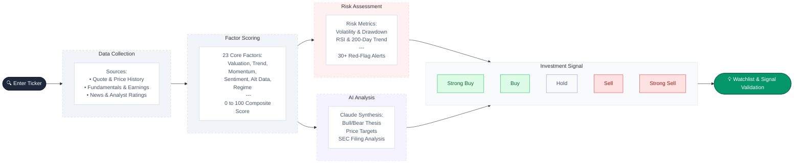

# jaja-money

[](https://github.com/pcjtse/jaja-money/actions/workflows/ci.yml)

**Institutional-grade stock research, reimagined for the AI era.**

jaja-money combines a 23-factor quantitative scoring engine, Claude AI synthesis, and a closed-loop signal validation system — giving any investor the analytical depth of a quant research desk, accessible from a browser.

> ⚠️ **Investment Disclaimer** — jaja-money is a research and educational tool only.
> **Nothing in this application constitutes financial, investment, or trading advice.**
> Always consult a qualified financial advisor before making any investment decisions.
> Past performance shown in backtests does not guarantee future results.

---

## The Opportunity

Stock research is broken in four ways. Quant tools are locked inside institutional platforms. AI assistants have no live market data. No one measures whether their signals actually work. And investment strategies are static — manually tweaked once a quarter if you're lucky.

jaja-money fixes all four. A 23-factor quant engine generates a composite Buy/Hold/Sell signal. Claude AI writes a live research report — bull thesis, bear risks, 12-month price target — grounded in real data. Every signal is tracked against actual forward returns, so the system measures whether it's generating alpha. And an overnight autoresearch loop (inspired by Andrej Karpathy's autonomous experimentation framework) iterates the backtesting strategy automatically — running ~12 experiments per hour, keeping improvements, reverting failures.

Four systems that traditionally require separate teams and separate budgets, unified in a single product that gets better while you sleep.

---

## Screenshots

| Main Dashboard | Stock Analysis |
|----------------|----------------|
|  |  |

| Compare Stocks | Stock Screener |
|----------------|----------------|
|  |  |

| Portfolio Analysis | Sector Rotation |
|--------------------|-----------------|
|  |  |

| Strategy Backtesting | Forward Testing |
|----------------------|-----------------|
|  |  |

| Daily Rankings | Signal Quality |
|----------------|----------------|
|  |  |

---

## Analysis Workflow


```mermaid
flowchart LR
    %% Global Styles
    classDef start fill:#1e293b,stroke:#0f172a,color:#fff
    classDef finish fill:#059669,stroke:#065f46,color:#fff
    classDef step fill:#fff,stroke:#cbd5e1,color:#475569
    
    classDef buy fill:#dcfce7,stroke:#22c55e,color:#166534
    classDef hold fill:#f8fafc,stroke:#94a3b8,color:#475569
    classDef sell fill:#fee2e2,stroke:#ef4444,color:#991b1b

    START(["🔍 Enter Ticker"]):::start

    subgraph D [Data Collection]
        D1["Sources:
        • Quote & Price History
        • Fundamentals & Earnings
        • News & Analyst Ratings"]:::step
    end

    subgraph F [Factor Scoring]
        F1["23 Core Factors:
        Valuation, Trend, Momentum,
        Sentiment, Alt Data, Regime
        ---
        0 to 100 Composite Score"]:::step
    end

    subgraph R [Risk Assessment]
        R1["Risk Metrics:
        Volatility & Drawdown
        RSI & 200-Day Trend
        ---
        30+ Red-Flag Alerts"]:::step
    end

    subgraph AI [AI Analysis]
        AI1["Claude Synthesis:
        Bull/Bear Thesis
        Price Targets
        SEC Filing Analysis"]:::step
    end

    subgraph SIG [Investment Signal]
        direction TB
        S1["Strong Buy"]:::buy
        S2["Buy"]:::buy
        S3["Hold"]:::hold
        S4["Sell"]:::sell
        S5["Strong Sell"]:::sell
    end

    END(["💡 Watchlist & Signal Validation"]):::finish

    %% Connections
    START --> D
    D --> F
    F --> R
    F --> AI
    R --> SIG
    AI --> SIG
    SIG --> END

    %% Subgraph Styling
    style D fill:#f1f5f9,stroke:#cbd5e1,stroke-dasharray: 5 5
    style F fill:#f1f5f9,stroke:#cbd5e1,stroke-dasharray: 5 5
    style R fill:#fff1f2,stroke:#fecaca,stroke-dasharray: 5 5
    style AI fill:#f5f3ff,stroke:#ddd6fe,stroke-dasharray: 5 5
    style SIG fill:#f8fafc,stroke:#e2e8f0
```

---

## Core Capabilities

### Quantitative Signal Engine

Twenty-three factors — spanning valuation, price trend, momentum, news sentiment, analyst consensus, earnings quality, alternative data, dark pool activity, congressional trades, institutional flow, options flow, supply chain risk, geographic revenue exposure, market regime, and more — are scored 0–100 and weighted into a single composite signal (Strong Sell → Strong Buy), displayed as a gauge, radar chart, and progress-bar breakdown.

Valuation is scored relative to the sector median, not absolute thresholds. Factor weights are configurable in `config.yaml` and can be replaced by the ML adaptive weighting module, which derives optimal weights from historical signal performance.

### Risk Guardrail Engine

Four risk dimensions weighted into an overall **Risk Score** (Low → Extreme), with 30+ colour-coded red-flag alerts covering volatility, drawdown, overbought/oversold RSI, downtrend conditions, high P/E, earnings miss rate, negative analyst sentiment, earnings proximity, insider selling clusters, elevated short interest, liquidity risk, volatility regime, and macroeconomic stress.

### AI Research Layer (Claude Opus 4.6)

- **Fundamental analysis** — 8-section investment research report streamed live with adaptive prompts per stock type (Growth / Value / Dividend / Cyclical / Defensive)
- **Price target** — AI-generated 12-month price target with bull/bear scenarios
- **News sentiment synthesis** — Claude synthesises bullish/bearish narratives from live headlines
- **Interactive research chat** — Ask any question about the stock; Claude answers with full context
- **Earnings transcript analysis** — Management tone, guidance confidence, and forward-looking statement analysis
- **SEC EDGAR** — Fetch and analyse 10-K, 10-Q, and 8-K filings with section-level diffing across quarters
- **Autonomous research agent** — Multi-step workflow with tool-call authority (up to 10 turns, with step trace)
- **PDF analysis** — Upload any financial PDF for Claude to parse and cross-reference with live data

### Signal Validation Loop

Every generated signal is tracked in SQLite. Forward returns at T+21, T+63, and T+126 trading-day horizons are filled automatically by a nightly batch job. The Signal Quality page computes Spearman Information Coefficient across all horizons, and Factor Attribution measures per-factor IC with 95% confidence intervals and Benjamini-Hochberg p-value correction — so you know not just what the system is recommending, but whether those recommendations are working.

### Self-Improving Strategy Engine (AutoResearch)

The backtesting engine ships with four named strategies and an autonomous optimization loop modelled on [Andrej Karpathy's autoresearch](https://github.com/karpathy/autoresearch) pattern.

| Strategy | Description |
|----------|-------------|
| **Price Technical v2** (default) | SMA trend 35% + directional RSI 25% + MACD 25% + Bollinger Band position 15% |
| **Price Technical v1** | Original baseline — SMA 40% + RSI 30% + MACD 30% |
| **MA Crossover** | Golden/death cross only. Fewer, longer trades. Best on trending large-caps. |
| **Momentum Breakout** | 52-week high proximity + RSI confirmation. Buys strength. |

The **autoresearch loop** lets a Claude Code agent iterate strategy variants overnight:

```bash
# Establish baseline
python autoresearch/evaluate.py

# Run the overnight optimization loop in Claude Code
# Agent reads autoresearch/program.md, modifies autoresearch/strategy_runner.py,
# runs the harness, keeps Sharpe improvements, reverts regressions.
# ~12 experiments/hour → 100 strategy variants tested overnight.
```

Every experiment is logged to `autoresearch/results.tsv`. Improvements are committed to git automatically. The result is a strategy that compounds improvements through AI experimentation rather than manual iteration.

### Market Data and Technicals

- **Real-time quotes** — price, change, day high/low, previous close
- **Interactive price chart** — candlestick with SMA(50/200), Bollinger Bands, volume, OBV, VWAP
- **Technical indicators** — RSI(14), MACD, Fibonacci levels
- **Earnings history** — EPS vs estimate vs surprise for last 4 quarters with beat probability
- **Analyst recommendations** — consensus bar chart and estimate revision momentum
- **Insider trading** — recent buy/sell activity with cluster detection
- **Short interest** — short % of float, days-to-cover, squeeze potential
- **Macroeconomic overlay** — VIX fear gauge and 2y/10y yield curve spread
- **Options market data** — IV surface, sweep/flow classification, gamma exposure
- **Alternative data** — Google Trends 90-day slope and job-posting velocity as leading revenue indicators
- **Dark pool activity** — FINRA ATS weekly volume share with spike detection
- **Congressional trades** — STOCK Act disclosure tracker with net buy/sell signal
- **Institutional flow** — 13F-proxy QoQ delta showing entering and exiting institutions
- **Catalyst calendar** — FOMC dates, earnings, and ex-dividend events with alpha-weight flags
- **Cross-asset signals** — Sector ETF momentum composite
- **Geographic revenue risk** — Region-weighted exposure from SEC text
- **Supply chain risk** — Sole-source concentration from 10-K filings
- **Special situations** — M&A, spinoff, and restructuring tracker via EDGAR
- **Market regime** — 5-state classifier with composite score multiplier

---

## Multi-Page Platform

| Page | What It Does |
|------|-------------|
| **Main Analysis** | Full factor score, risk assessment, AI research, and signal for any ticker |
| **Compare** | Side-by-side factor scores, risk, P/E, RSI for up to 5 stocks with correlation heatmap and peer benchmarking |
| **Screener** | Filter S&P 500, Russell 1000, or custom universe with AND/OR logic, quick presets, ESG filter, and Claude natural-language queries |
| **Portfolio** | Correlation matrix, beta, Monte Carlo simulation (10,000 paths), Kelly criterion sizing, and factor attribution |
| **Sectors** | Relative strength across 11 S&P 500 sector ETFs with rotation phase and momentum quadrant chart |
| **Backtest** | Walk-forward signal simulation with 4 pluggable strategies (v1/v2/MA Crossover/Momentum Breakout), equity curve, Sharpe ratio, max drawdown, parameter sweep heatmap, DRIP support, and autoresearch optimizer |
| **Forward Test** | SQLite-backed paper portfolio that tracks live P&L, equity curve, Sharpe, win rate, and average factor/risk score at entry |
| **Rankings** | Daily cross-sectional long/short leaderboard with sector breakdown, percentile ranks, and AI thesis |
| **Signal Quality** | Spearman IC at T+21/T+63/T+126 horizons — measures whether composite scores predict forward returns |
| **Factor Attribution** | Per-factor IC with 95% CI and Benjamini-Hochberg correction across all 23 factors |
| **Ledger** | Tamper-evident signal ledger tracking entry/exit prices; generates signal decay curves and a Claude research narrative after 20+ closed trades |

---

## Additional Capabilities

- **Nightly batch analysis** — APScheduler-backed overnight scoring of every watchlist ticker; seeds Signal Quality and Factor Attribution automatically
- **AutoResearch strategy optimizer** — autonomous overnight loop that iterates backtesting strategy code, keeping Sharpe improvements and reverting regressions (~12 experiments/hour)
- **Watchlist** — Save tickers with factor scores, persisted across sessions
- **Price and signal alerts** — Threshold alerts with Slack / Discord / Telegram webhook delivery
- **Daily digest** — Claude-written morning briefing for your entire watchlist (HTML + optional email)
- **Named snapshots** — Save and diff analysis states over time
- **Google Sheets export** — Write results to a Google Sheet via service account
- **Brokerage CSV import** — Auto-detect Schwab, Fidelity, and IBKR position exports
- **ML factor weighting** — Adaptive factor weights derived from historical signal performance
- **REST API** — FastAPI server for programmatic access (see [REST_API.md](REST_API.md))
- **Agent Skill** — Use as an [Agent Skill](https://agentskills.io) with OpenClaw, Claude Code, or any compatible AI agent

---

## Integration

jaja-money is packaged as an **Agent Skill** following the [Agent Skills standard](https://agentskills.io), making it embeddable in any AI agent or automated workflow.

### Python SDK

```python
from jaja_money_skill.scripts.jaja_skill import analyze, screen, score, research

# Full fundamental + risk analysis
result = analyze("AAPL")
# {'symbol': 'AAPL', 'signal': 'BUY', 'confidence': 74, 'factor_score': 72, ...}

# Screen a universe by factor and risk thresholds
hits = screen(["AAPL", "MSFT", "NVDA"], min_factor_score=65, max_risk_score=50)

# Autonomous multi-step research agent
memo = research("TSLA", question="What is the bear case?")
```

### REST API

A FastAPI server exposes every capability as HTTP endpoints — full analysis, scoring, screening, alerts, and the autonomous research agent. See [REST_API.md](REST_API.md) for the full reference.

### Remote Mode

Point the skill at a running jaja-money server for distributed or multi-agent setups:

```bash
export JAJA_API_URL=http://analysis-server:8080
export JAJA_API_KEY=mysecret
```

### Event-Triggered Analysis

APScheduler fires analysis callbacks on earnings proximity, new SEC filings, and price/signal threshold breaches — enabling fully automated monitoring workflows.

---

## Quick Start

**Requirements:** Python 3.10+, [Finnhub API key](https://finnhub.io) (free tier), [Anthropic API key](https://console.anthropic.com)

```bash
# Clone and install
git clone https://github.com/pcjtse/jaja-money.git
cd jaja-money
python3 -m venv venv && source venv/bin/activate
pip install -r requirements.txt

# Configure
cp .env.example .env
# Edit .env: add FINNHUB_API_KEY and ANTHROPIC_API_KEY

# Run
streamlit run app.py
```

Open `http://localhost:8501`, enter a ticker in the sidebar, and click **Analyze**.

> **Tip:** If you have the [Claude Code CLI](https://claude.ai/code) installed, set `ai_backend: "cli"` in `config.yaml` to skip the `ANTHROPIC_API_KEY` requirement.

### Docker

```bash
cp .env.example .env   # add your keys
docker compose up --build
```

---

## Environment Variables

| Variable | Required | Description |
|---|---|---|
| `FINNHUB_API_KEY` | Yes | Finnhub market data |
| `ANTHROPIC_API_KEY` | Yes* | Claude AI (*or use `ai_backend: cli`) |
| `JAJA_API_KEY` | No | Protects REST API endpoints |
| `JAJA_API_URL` | Remote mode | URL of jaja-money server for remote skill mode |
| `ALPACA_API_KEY` | Monitoring only | Alpaca API key for read-only account monitoring |
| `ALPACA_API_SECRET` | Monitoring only | Alpaca API secret |

---

## Data Architecture

jaja-money uses two time-series stores with distinct purposes:

| Store | Horizons | Purpose |
|-------|----------|---------|
| `signal_returns` in `history.db` | T+21 / T+63 / T+126 trading days | Factor IC research — Spearman correlation of composite score vs forward return |
| `data/ledger.json` | T+5 / T+10 / T+30 calendar days | Paper trade P&L tracking for the Forward Test portfolio |

These serve different analytical purposes and use incompatible time units. They must not be merged.

---

*For REST API documentation, see [REST_API.md](REST_API.md).*
