# jaja-money

[](https://github.com/pcjtse/jaja-money/actions/workflows/ci.yml)

**The Bloomberg Terminal charges $25,000 per seat per year. It doesn't use AI. It doesn't measure whether its signals work. And it hasn't changed fundamentally in 30 years.**

jaja-money is what institutional stock research looks like when you build it from scratch in 2026 — a 23-factor quantitative scoring engine, Claude AI synthesis, a closed-loop signal validation system that measures real alpha, and an autonomous strategy optimizer that improves overnight while you sleep.

> ⚠️ **Investment Disclaimer** — jaja-money is a research and educational tool only.
> **Nothing in this application constitutes financial, investment, or trading advice.**
> Always consult a qualified financial advisor before making any investment decisions.
> Past performance shown in backtests does not guarantee future results.

---

## The Market

**100+ million** retail investors in the US alone. **$30 trillion** in assets managed by RIAs and family offices. **$6 billion** in annual Bloomberg Terminal revenue — from a product that charges $25,000 per seat for infrastructure that predates the smartphone.

The AI inflection point changes the unit economics of research entirely. Tasks that previously required a team of quant analysts — factor scoring, risk modeling, SEC filing analysis, signal backtesting, strategy optimization — now run in seconds. The question is no longer whether institutional-grade research can be democratized. It's who builds the platform that does it.

The window is open right now. Incumbent data vendors can't retrofit AI onto 30-year-old architecture without rebuilding from scratch. We built from scratch.

---

## What We Built

Four things that have never existed in a single product before.

**1. A 23-factor quantitative signal engine.** Valuation (sector-relative, not absolute), price trend, momentum, news sentiment, earnings quality, analyst consensus, alternative data (Google Trends slope, job-posting velocity as leading revenue indicators), dark pool activity, congressional STOCK Act disclosures, institutional 13F flow, options sweep analysis, supply chain concentration from 10-K filings, geographic revenue risk from SEC text, market regime classification, and more — each scored 0–100 and composited into a single Buy/Hold/Sell signal with a configurable ML weighting layer.

**2. An AI research layer powered by Claude Opus 4.6.** Not a chatbot on top of a data feed. An analyst that reads 10-K and 10-Q filings directly from EDGAR, synthesizes earnings call transcripts, generates live 12-month price targets with bull/bear scenarios, and writes 8-section investment research reports adapted to stock type (Growth / Value / Dividend / Cyclical / Defensive). Every response is grounded in real-time market data and streamed live.

**3. A signal validation loop.** Every generated signal is tracked against actual forward returns at T+21, T+63, and T+126 trading days. Spearman Information Coefficient measures whether composite scores actually predict returns. Benjamini-Hochberg multiple-comparison correction identifies which of the 23 factors are contributing genuine alpha — and which are noise. Most financial platforms generate signals and never look back. This one closes the loop.

**4. A self-improving strategy engine.** The backtesting system is wired into an autonomous optimization loop modelled on [Andrej Karpathy's autoresearch](https://github.com/karpathy/autoresearch) framework. A Claude Code agent iterates strategy variants overnight — roughly 12 experiments per hour — keeping Sharpe ratio improvements and automatically reverting regressions. Every result is committed to git. The investment strategy compounds improvements through machine experimentation, not manual quarterly tuning.

---

## Screenshots

| Main Dashboard | Stock Analysis |
|----------------|----------------|
| 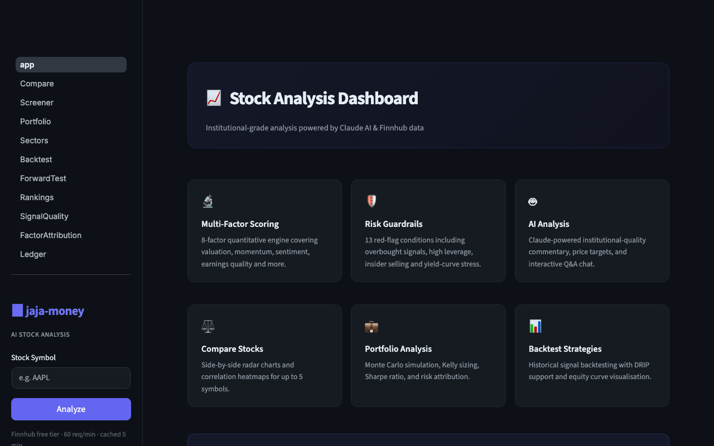 | 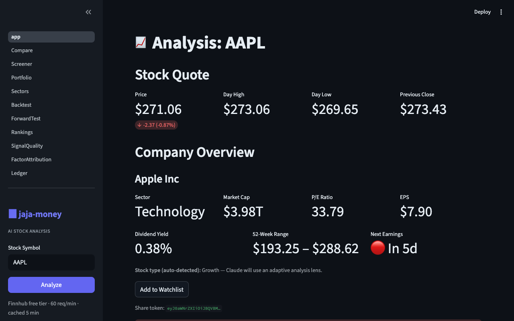 |

| Compare Stocks | Stock Screener |
|----------------|----------------|
| 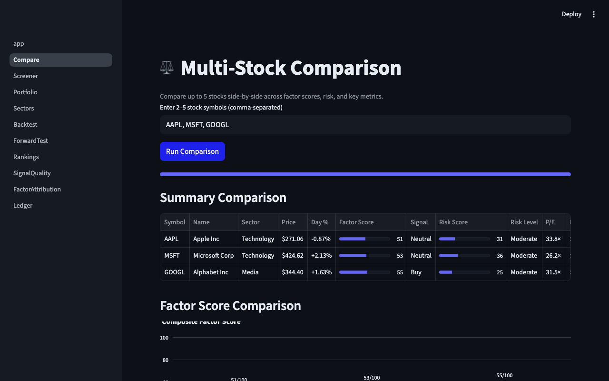 | 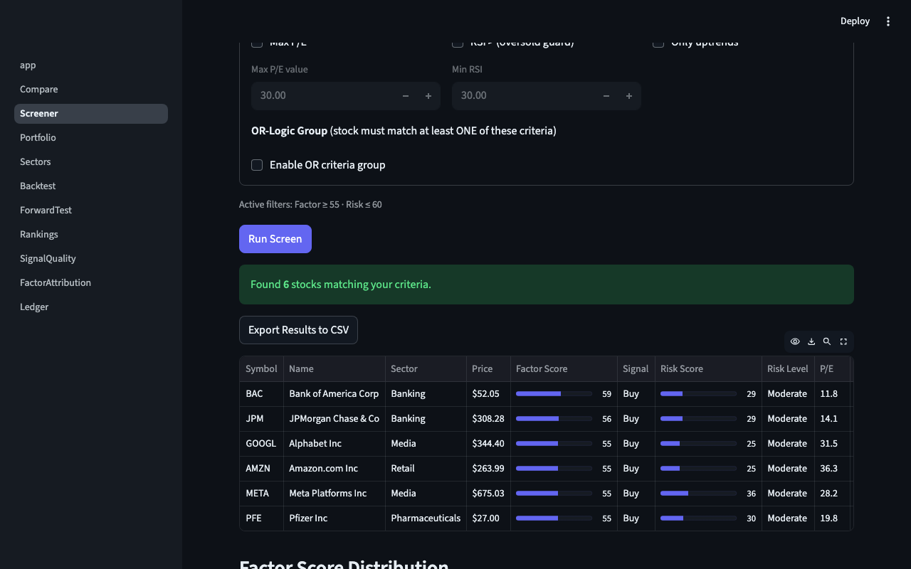 |

| Portfolio Analysis | Sector Rotation |
|--------------------|-----------------|
| 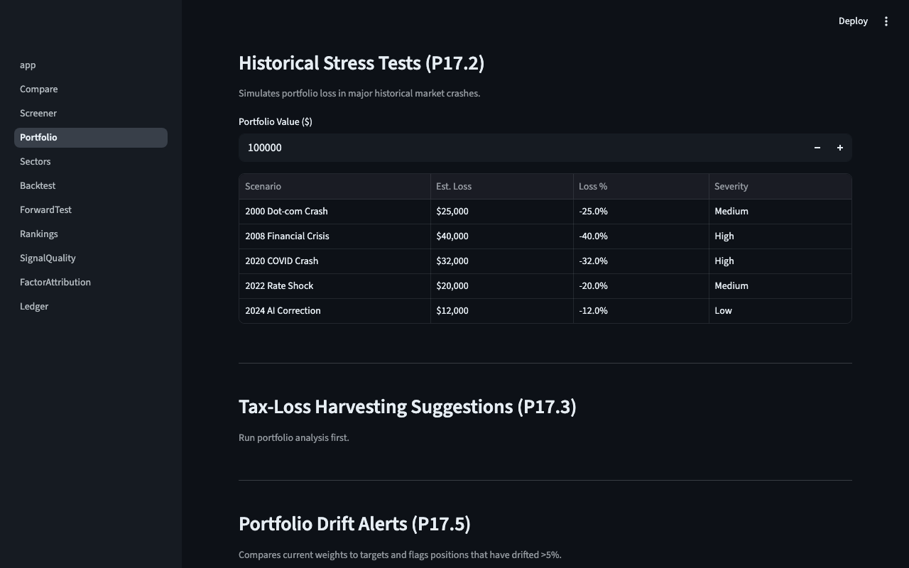 | 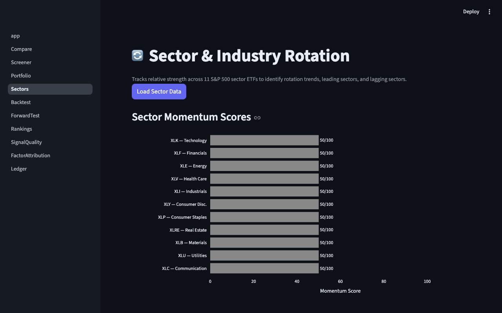 |

| Strategy Backtesting | Forward Testing |
|----------------------|-----------------|
| 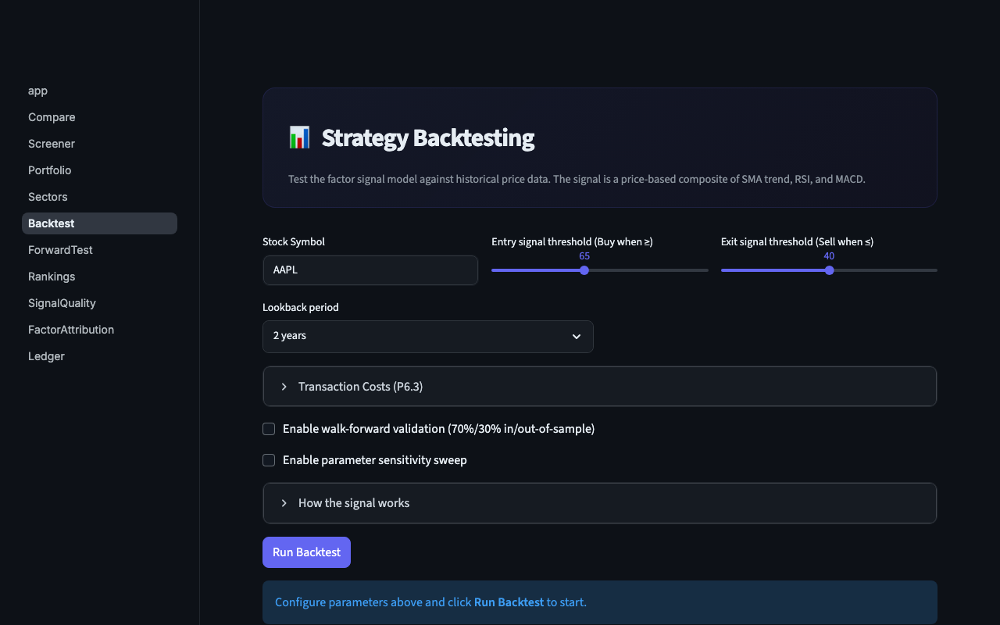 | 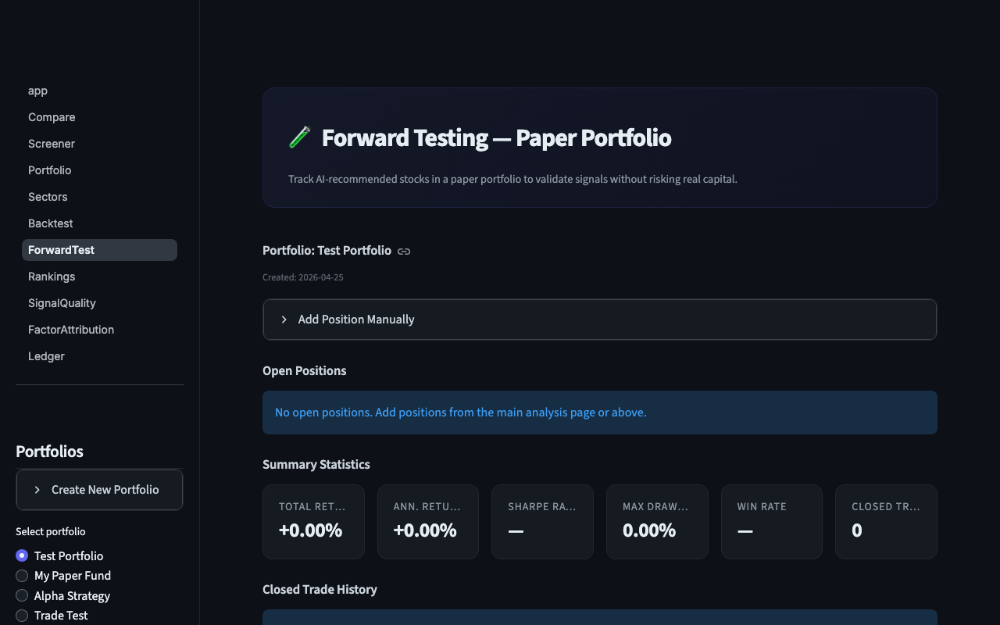 |

| Daily Rankings | Signal Quality |
|----------------|----------------|
| 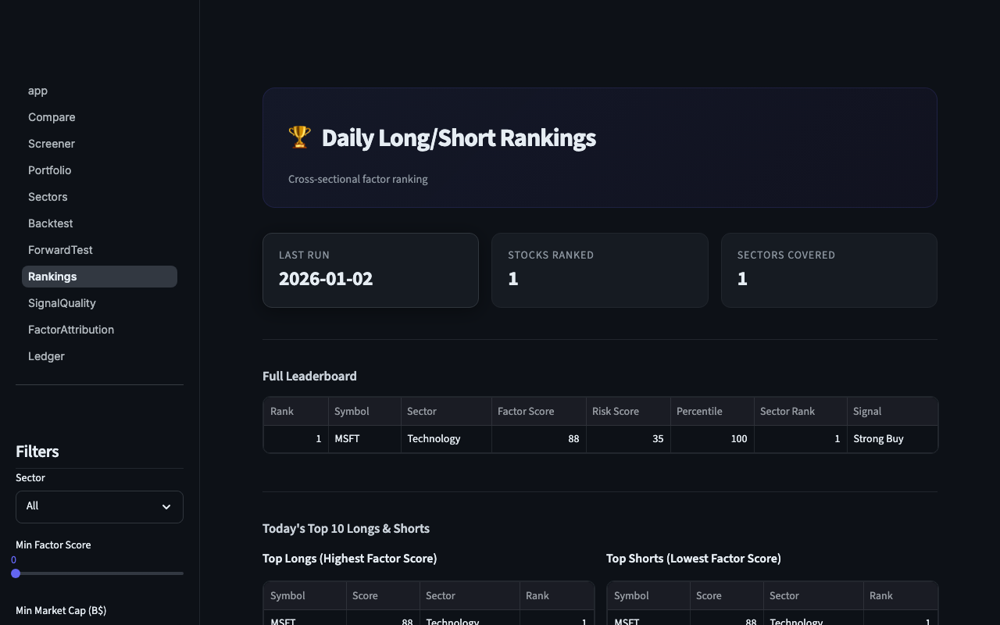 | 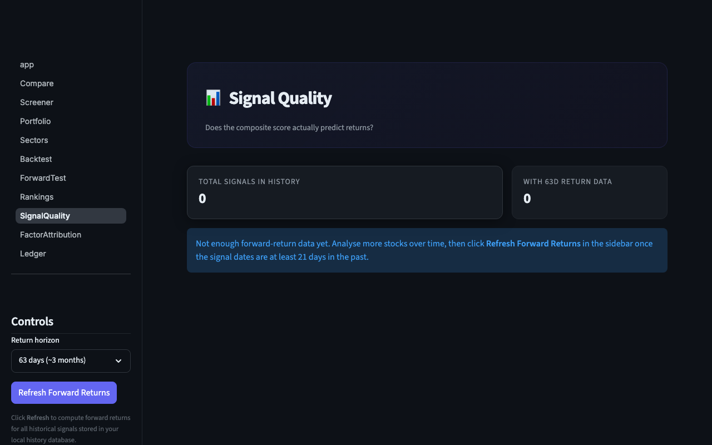 |

---

## Why This Wins

### The Bloomberg Problem Is Structural

Bloomberg's moat is data access and switching costs — not analytical depth. Their terminals were designed before machine learning existed and patched forward. Adding AI to that architecture is like adding autonomous driving to a 1995 car. You can bolt sensors on, but the fundamental systems weren't designed for it.

We designed for it. The 23-factor engine was built to be ML-weighted from day one. The signal validation loop was designed to feed back into factor weights. The autoresearch optimizer was designed to close the loop between backtest performance and live strategy. Every layer was built to compound.

### Three Defensible Moats

**Signal validation data is proprietary and accumulates over time.** Every signal the system generates becomes a data point in the IC dataset. After a year of use, the system has a proprietary record of which signals predicted returns, in which sectors, under which market regimes. No competitor can replicate this retroactively. The longer the platform runs, the better calibrated the factor weights become.

**The autoresearch loop creates a compounding strategy advantage.** Each overnight optimization session improves the backtesting strategy. Each improvement is committed to version control and logged with its Sharpe metric. Competitors who rely on human researchers to manually tune strategies cannot compound improvements at the same rate. An AI agent that runs 100 experiments overnight is not a feature — it's a new category of R&D capability.

**The 23-factor signal depth took years to build and can't be replicated overnight.** Congressional trade STOCK Act parsing, dark pool FINRA ATS volume spike detection, supply chain sole-source concentration from 10-K text, SEC EDGAR full-text diffing across quarters, FinBERT news sentiment with multi-article aggregation — each signal required engineering investment that compounds into competitive advantage as the validation dataset proves which signals actually work.

### Why Now

Two things became true at the same time. Claude Opus 4.6 crossed the threshold where it can read an SEC 10-K, synthesize earnings call transcripts, and produce a credible institutional-grade investment memo in seconds. And the cost of running that analysis dropped to near zero. Neither was true 18 months ago. The window to build the AI-native research platform is open now — and closing as incumbents wake up to the threat.

---

## Analysis Workflow

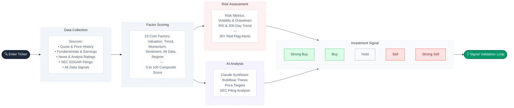
```mermaid
flowchart LR
    %% Global Styles
    classDef start fill:#1e293b,stroke:#0f172a,color:#fff
    classDef finish fill:#059669,stroke:#065f46,color:#fff
    classDef step fill:#fff,stroke:#cbd5e1,color:#475569
    
    classDef buy fill:#dcfce7,stroke:#22c55e,color:#166534
    classDef hold fill:#f8fafc,stroke:#94a3b8,color:#475569
    classDef sell fill:#fee2e2,stroke:#ef4444,color:#991b1b

    START(["🔍 Enter Ticker"]):::start

    subgraph D [Data Collection]
        D1["Sources:
        • Quote & Price History
        • Fundamentals & Earnings
        • News & Analyst Ratings
        • SEC EDGAR Filings
        • Alt Data Signals"]:::step
    end

    subgraph F [Factor Scoring]
        F1["23 Core Factors:
        Valuation, Trend, Momentum,
        Sentiment, Alt Data, Regime
        ---
        0 to 100 Composite Score"]:::step
    end

    subgraph R [Risk Assessment]
        R1["Risk Metrics:
        Volatility & Drawdown
        RSI & 200-Day Trend
        ---
        30+ Red-Flag Alerts"]:::step
    end

    subgraph AI [AI Analysis]
        AI1["Claude Synthesis:
        Bull/Bear Thesis
        Price Targets
        SEC Filing Analysis"]:::step
    end

    subgraph SIG [Investment Signal]
        direction TB
        S1["Strong Buy"]:::buy
        S2["Buy"]:::buy
        S3["Hold"]:::hold
        S4["Sell"]:::sell
        S5["Strong Sell"]:::sell
    end

    END(["💡 Signal Validation Loop"]):::finish

    %% Connections
    START --> D
    D --> F
    F --> R
    F --> AI
    R --> SIG
    AI --> SIG
    SIG --> END

    %% Subgraph Styling
    style D fill:#f1f5f9,stroke:#cbd5e1,stroke-dasharray: 5 5
    style F fill:#f1f5f9,stroke:#cbd5e1,stroke-dasharray: 5 5
    style R fill:#fff1f2,stroke:#fecaca,stroke-dasharray: 5 5
    style AI fill:#f5f3ff,stroke:#ddd6fe,stroke-dasharray: 5 5
    style SIG fill:#f8fafc,stroke:#e2e8f0
```

---

## The Platform

Eleven integrated modules, each solving a specific problem in the investment research workflow.

| Module | What It Solves |
|--------|---------------|
| **Main Analysis** | Full 23-factor score, 30+ risk alerts, live AI research report, and price target for any ticker in one view |
| **Compare** | Side-by-side factor scores, risk, P/E, RSI for up to 5 stocks with correlation heatmap and automatic peer group benchmarking |
| **Screener** | Filter S&P 500, Russell 1000, or any custom universe with AND/OR logic, ESG filter, and Claude natural-language queries ("show me undervalued tech stocks with strong earnings momentum") |
| **Portfolio** | Correlation matrix, beta, 10,000-path Monte Carlo simulation, Kelly criterion position sizing, and factor attribution |
| **Sectors** | Relative strength across all 11 S&P 500 sector ETFs with rotation phase classification and momentum quadrant chart |
| **Backtest** | Walk-forward signal simulation with 4 pluggable strategies, equity curve, Sharpe ratio, max drawdown, parameter sweep heatmap, DRIP support, and the autoresearch optimizer |
| **Forward Test** | Paper portfolio tracking live P&L, equity curve, Sharpe, win rate, and factor/risk score at entry — the bridge between backtest and real-money conviction |
| **Rankings** | Daily cross-sectional long/short leaderboard with sector breakdown, percentile ranks, and AI investment thesis for top long/short candidates |
| **Signal Quality** | Spearman IC at T+21/T+63/T+126 horizons — empirical evidence of whether the composite score predicts forward returns |
| **Factor Attribution** | Per-factor IC with 95% CI and Benjamini-Hochberg correction — identifies which of the 23 factors are contributing real alpha |
| **Ledger** | Tamper-evident signal ledger that commits entry signals with entry prices and tracks outcomes; generates signal decay curves and a Claude research narrative after 20+ closed trades |

---

## Technical Depth

### 23-Factor Signal Engine

Every factor is independently scored 0–100 and weighted into a composite signal. Valuation is scored relative to sector median, not absolute thresholds, eliminating the problem of sectors with structurally different P/E profiles. Weights are configurable in `config.yaml` and can be replaced by the ML adaptive weighting module, which derives optimal weights from the accumulated IC validation dataset.

Factors span five categories:

- **Price & Technical** — SMA trend (50/200), RSI momentum, MACD histogram, Bollinger Band position, 52-week strength
- **Fundamental** — Valuation (sector-adjusted P/E), earnings quality, estimate revisions, analyst consensus, dividend yield, guidance quality, buyback effectiveness
- **Alternative Data** — Google Trends 90-day slope, job-posting velocity (Adzuna), dark pool FINRA ATS volume, STOCK Act congressional disclosures, institutional 13F flow, options sweep/gamma
- **Structural** — Supply chain sole-source concentration (10-K), geographic revenue risk (SEC text), special situations (M&A, spinoffs via EDGAR), cross-asset sector ETF momentum
- **Regime** — 5-state market regime classifier (Risk-On Growth → Risk-Off Panic) applied as a composite multiplier; crowding risk as a score penalty

### Self-Improving Backtesting (AutoResearch)

The autoresearch optimizer uses a tight experimentation loop:

1. Agent reads `autoresearch/program.md` (research brief) and `autoresearch/strategy_runner.py` (current strategy)
2. Proposes one targeted modification based on results history in `autoresearch/results.tsv`
3. Modifies `strategy_runner.py` and runs `autoresearch/evaluate.py` (fixed harness — agent cannot modify it)
4. If Sharpe improves on the AAPL/MSFT/GOOGL 3-year benchmark: commits and logs the improvement
5. If not: reverts and logs the failure
6. Loop — roughly 12 experiments per hour, 100+ overnight

This is not random search. The agent reads failure patterns before proposing changes, making it structured experimentation. Shopify applied the same pattern to build performance and saw 65% CI improvement. We applied it to investment strategy.

### Signal Validation Architecture

```
Daily Batch (APScheduler, 7am UTC)
  → Score every watchlist ticker (23 factors)
  → Save to analysis_history
  → Upsert to signal_returns with entry price

Nightly Forward Return Fill
  → For signals T+21/T+63/T+126 days old: fetch current price
  → Compute and store actual forward return

Signal Quality Page
  → Spearman IC per horizon
  → Factor Attribution with Benjamini-Hochberg correction
  → Rolling IC trend (detects signal decay over time)
```

### API-First Architecture

jaja-money is packaged as an **Agent Skill** and exposes a full **FastAPI REST server**, making it embeddable in any AI agent, trading system, or institutional workflow.

```python
from jaja_money_skill.scripts.jaja_skill import analyze, screen, research

result = analyze("AAPL")
# {'symbol': 'AAPL', 'signal': 'BUY', 'factor_score': 72, 'risk_score': 28, ...}

hits = screen(["AAPL", "MSFT", "NVDA", "GOOGL"], min_factor_score=65, max_risk_score=50)

memo = research("TSLA", question="What is the bear case for the next 12 months?")
```

Remote mode: point any agent at a running jaja-money server over HTTP. The REST API exposes every capability — analysis, scoring, screening, alerts, research — with optional API key authentication.

---

## Quick Start

**Requirements:** Python 3.10+, [Finnhub API key](https://finnhub.io) (free tier), [Anthropic API key](https://console.anthropic.com)

```bash
git clone https://github.com/pcjtse/jaja-money.git
cd jaja-money
python3 -m venv venv && source venv/bin/activate
pip install -r requirements.txt
cp .env.example .env          # add FINNHUB_API_KEY and ANTHROPIC_API_KEY
streamlit run app.py
```

Open `http://localhost:8501`, enter any ticker, click **Analyze**.

```bash
# Docker
cp .env.example .env
docker compose up --build
```

> If you have the [Claude Code CLI](https://claude.ai/code) installed, set `ai_backend: "cli"` in `config.yaml` — no `ANTHROPIC_API_KEY` needed.

### Run the AutoResearch Optimizer

```bash
python autoresearch/evaluate.py   # baseline Sharpe measurement
# Then in Claude Code: /loop
# Agent iterates strategy_runner.py overnight, logs results to autoresearch/results.tsv
```

---

## Environment Variables

| Variable | Required | Description |
|---|---|---|
| `FINNHUB_API_KEY` | Yes | Finnhub market data |
| `ANTHROPIC_API_KEY` | Yes* | Claude AI (*or use `ai_backend: cli`) |
| `JAJA_API_KEY` | No | Protects REST API endpoints |
| `JAJA_API_URL` | Remote mode | URL of jaja-money server |
| `ALPACA_API_KEY` | Monitoring | Read-only Alpaca account monitoring |
| `ALPACA_API_SECRET` | Monitoring | Alpaca API secret |

---

*For REST API documentation, see [REST_API.md](REST_API.md).*
